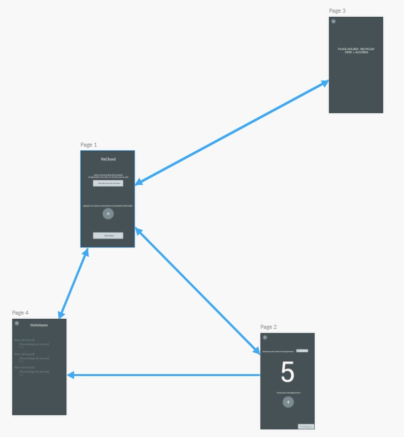
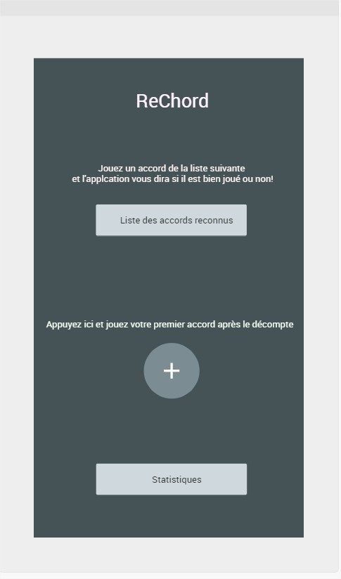
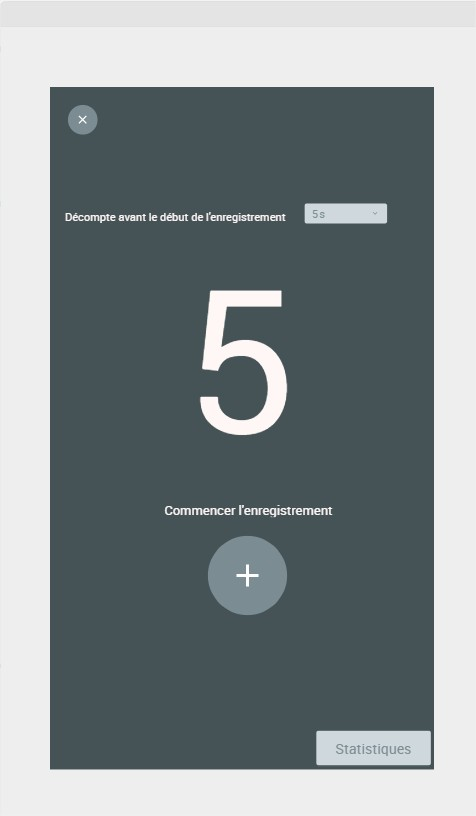
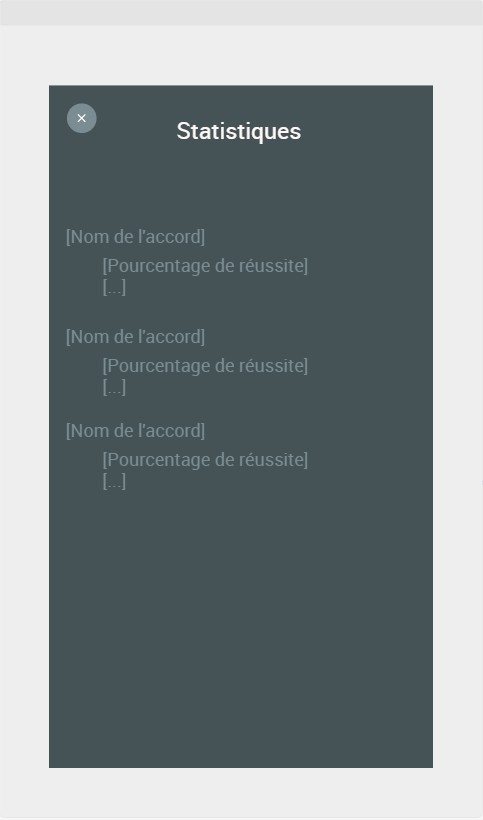

#### projetelim

##### Projet ELIM Bond / Munier

# Rechord
Aide à l'apprentisage des accords de guitare.

BOND Adam : IAM, adam.bond@etu.unice.fr
MUNIER Rémy : IAM, remy.munier@etu.unice.fr

### Scénario

L'ulisateur veut apprendre la guitare, et pour cela il s'entraîne à jouer ses premiers accords. Mais comme il débute et qu'il n'a pas de professeur, il ne sait pas si il joue correctement ces accords. Avec notre application, il peut s'entraîner jusqu'à le jouer parfaitement; l'application lui indique l'écart avec l'accord recherché avec un affichage sous forme de signal audio ludique.

Des exemples audio de bon et mauvais accords sont disponible sur le git.

### Architecture
Notre serveur expose une API REST pour demander une classification d'un son enregistré, et récupérer le résultat pour l'afficher a l'utilisateur.

Les données audio brutes passeront par un pré-traitement qui reste a établir (transformée de fourier, isolation du bruit, etc..) afin d'améliorer les prédictions et d'éliminer les conditions variables dépendantes de l'utilisateur et de sa situation. Ensuite, un algorithme pré-entrainé (SVM) classifiera l'accord en entrée et enverra la réponse à l'application. Cet algorithme devra être mis a jour périodiquement avec l'évolution de notre jeu de données.

Pour le jeu de données, on enregistre des accords joués à la guitare, dans des conditions différentes (Bruits, qualité de l'accord, guitare, micro du téléphone ...) et en utilisant la classification, l'application sera capable de classer l'accord joué dans l'une des catégories :
  - Réussi
  - Raté : Guitare désaccordée
  - Raté : Intervalles harmonique différents
  - Raté : Sons parasites
  - Non reconnu.
  
Le format des données reste a établir en détails: format de fichier, bit rate, et la taille du jeu de données aussi. Nous proposons d'abord une implémentation avec SVM car ils ont généralement besoin de moins de données pour être efficaces qu'un réseau de neurones par exemple, et sont plus rapides à entrainer.

Nous voyons deux modes d'utilisation possible: 
1) l'utilisateur veut s'entrainer a un accord en particulier, et peut le spécifier dans l'application. L'échantillon reçu par le serveur est alors déja annoté et peut être utilisé pour compléter notre jeu de données (prédiction particulièrement basse / avec peu de probabilité qu'il sera intéressant de considérer)
2) l'utilisateur s'entraine à plusieurs accords à la suite, et la question est alors double: prédire quel accord est joué et si il est bien fait. Un retour de l'utilisateur quand a la précision de notre prédiction peut ici aussi être ajouté pour compléter notre dataset.

Optionnel: En stockant la progression des utilisateurs, nous pourrions recommander le prochain accord à apprendre pour un utilisateur donné, en se basant sur ce que d'autres qui avait des connaissances similaires ont appris par la suite. On pourrait aussi imaginer un aspect "jeu" en indiquant à l'utilisateur qu'il a apprit tel ou tel accord X% plus rapidement que la moyenne, ou avec plus de précision que la moyenne, etc.

### Application
Premier mockup des écrans de l'application :

